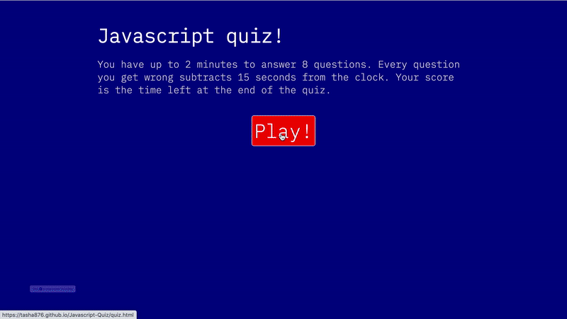

# Javascript-Quiz
A short interactive Javascript Quiz.

## Table of Contents
1. [ Description ](#desc)
2. [ Visuals ](#visuals)
3. [ Deployed Webpage ](#deployed)
4. [ Support ](#support)
5. [ Authors and Acknowledgement ](#acknowledge)
6. [ License ](#license)

## 1. Description
The user has up to 2 minutes to answer 8 questions. Every question the user gets wrong subtracts 15 seconds from the clock. The user's score is the time left at the end of the quiz.

### Summary of functionality
- the user can play a short quiz that tests their knowledge of Javascript.
- If the user gets a highscore (one of the ten best), they can enter their name to be displayed on the highscore board
- If the user does not get a highscore (or 0), a message is displayed saying "Better luck next time".

## 2. Visuals
GIF of the webpage 

## 3. Deployed Webpage
[The deployed site](https://tasha876.github.io/Javascript-Quiz/index.html), hosted by GitHub Pages.

## 4. Support
Should you find an issue with this webpage, please create a [new issue](https://github.com/Tasha876/Javascript-Quiz/issues) on my GitHub repository.

## 5. Authors and Acknowledgement
The code in this project was created by Natasha Fray. The idea for the project was from the instructors at the [U of T Coding Bootcamp](https://bootcamp.learn.utoronto.ca/).

## 6. License
This project is covered by the [MIT](license) license.

